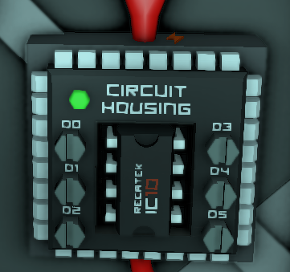

# IC10s

A collection of scripts for Stationeer's programmable IC10 chip.

## Table of Contents

* Atmospherics
    * [Filtration](atmo-filtration.ic10)
    * [Fuel mixing + water making](atmo-fuel-mixing-water-making.ic10)
* Rocketry
    * [Salvage Rocket (operate)](rocket-salvage-operatoe.ic10)
    * [Salvage Rocket (flight)](rocket-salvage-flight.ic10)
    * [Salvage Rocket (display)](rocket-salvage-display.ic10)

## License

This is free and unencumbered software released into the public domain. See the [UNLICENSE](UNLICENSE) file for more details.